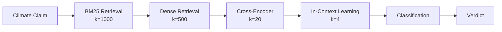

# Climate Misinformation Detection with Hybrid Retrieval and LLMs

[](https://www.python.org/downloads/)
[](https://pytorch.org/)
[](https://huggingface.co/transformers/)
[](https://github.com/facebookresearch/faiss)
[](https://opensource.org/licenses/MIT)

A sophisticated AI system for automated climate fact-checking that combines classical information retrieval with modern transformer models to detect misinformation in climate science claims.

## 🎯 Overview

This project addresses the critical challenge of combating climate misinformation through automated fact-checking. Our system retrieves relevant scientific evidence and verifies claims across four categories: **SUPPORTS**, **REFUTES**, **NOT_ENOUGH_INFO**, and **DISPUTED**.

### Key Innovation: Hybrid 4-Stage Pipeline



## 🏗️ Technical Architecture

### Multi-Stage Retrieval System

| Stage | Method | Model | Purpose | Output Size |
|-------|--------|-------|---------|-------------|
| **1** | Keyword Matching | BM25 (Okapi) | Initial filtering | k=1000 |
| **2** | Semantic Search | MiniLM-L6-v2 | Dense retrieval | k=500 |
| **3** | Reranking | Cross-Encoder | Relevance scoring | k=20 |
| **4** | LLM Reasoning | FLAN-T5 | Context-aware selection | k=4 |

### Core Models

- **🔍 Retrieval**: Sentence Transformers (all-MiniLM-L6-v2)
- **🎯 Reranking**: Cross-Encoder (ms-marco-MiniLM-L12-v2)
- **🧠 Classification**: RoBERTa-base (fine-tuned)
- **💬 LLM**: FLAN-T5 (in-context learning)

## 📊 Dataset & Performance

### Dataset Scale
- **📚 Evidence Corpus**: 1,208,827 scientific passages
- **🎯 Training Claims**: 1,228 labeled instances
- **🔬 Validation Set**: 154 claims
- **📈 Test Set**: 153 claims

### Label Distribution
| Category | Training | Development | Description |
|----------|----------|-------------|-------------|
| **SUPPORTS** | 519 (42.3%) | 68 (44.2%) | Evidence confirms claim |
| **REFUTES** | 199 (16.2%) | 27 (17.5%) | Evidence contradicts claim |
| **NOT_ENOUGH_INFO** | 386 (31.4%) | 41 (26.6%) | Insufficient evidence |
| **DISPUTED** | 124 (10.1%) | 18 (11.7%) | Conflicting evidence |

### Performance Results

| Approach | Evidence Retrieval F-Score | Classification Accuracy | Harmonic Mean |
|----------|----------------------------|------------------------|---------------|
| **Fine-tuned RoBERTa** | **0.177** | **0.532** | **0.266** |
| In-Context FLAN-T5 | 0.195 | 0.364 | 0.254 |
| Baseline | 0.338 | 0.351 | 0.344 |

## 🚀 Quick Start

### Installation

```bash
# Clone the repository
git clone https://github.com/pranavpai/NLP-Climate-Research.git
cd NLP-Climate-Research

# Install dependencies
pip install torch transformers sentence-transformers faiss-cpu
pip install pandas numpy matplotlib seaborn tqdm
pip install wandb  # Optional: for experiment tracking
```

### Usage

```python
# Open the main notebook
jupyter notebook mainproject.ipynb

# Or run specific components
from climate_fact_checker import ClimateFactChecker

# Initialize the system
fact_checker = ClimateFactChecker()

# Process a climate claim
claim = "CO2 has no effect on global temperatures"
result = fact_checker.verify_claim(claim)
print(f"Verdict: {result['label']} (Confidence: {result['confidence']:.3f})")
```

## 🔬 Methodology

### 1. Evidence Retrieval Pipeline

**Stage 1: BM25 Keyword Matching**
- Classical TF-IDF based retrieval
- Handles exact term matches effectively
- Filters initial candidate set (k=1000)

**Stage 2: Dense Semantic Retrieval**
- Sentence Transformers encode claims and evidence
- FAISS enables efficient similarity search
- Captures semantic relationships (k=500)

**Stage 3: Cross-Encoder Reranking**
- Fine-tuned on claim-evidence pairs
- Pairwise relevance scoring
- Significantly improves precision (k=20)

**Stage 4: LLM-based Context Selection**
- FLAN-T5 with few-shot prompting
- Context-aware evidence selection
- Final evidence set for classification (k=4)

### 2. Claim Classification

**Approach A: Fine-tuned Classification**
- RoBERTa-base fine-tuned on claim-evidence pairs
- Pairwise training with majority voting
- Handles class imbalance with weighted loss

**Approach B: In-Context Learning**
- FLAN-T5 with demonstration examples
- Zero-shot classification capabilities
- Leverages pre-trained reasoning abilities

## 📈 Key Findings

### Research Contributions

1. **🔄 Hybrid Architecture**: Successfully combines classical IR with neural methods
2. **📊 Progressive Refinement**: Each stage improves evidence quality
3. **🌍 Climate Domain Adaptation**: Specialized for climate science fact-checking
4. **🎯 Multi-Modal Evaluation**: Considers both retrieval and classification performance

### Performance Analysis

- **Fine-tuned models** outperform in-context learning for classification
- **Retrieval quality** is the primary bottleneck for overall performance
- **Class imbalance** particularly affects DISPUTED category detection
- **Evidence diversity** crucial for robust fact-checking

## 🛠️ Technical Implementation

### Dependencies

```python
torch>=1.9.0
transformers>=4.20.0
sentence-transformers>=2.2.0
faiss-cpu>=1.7.0
pandas>=1.3.0
numpy>=1.21.0
matplotlib>=3.5.0
seaborn>=0.11.0
tqdm>=4.64.0
```

### System Requirements
- **Memory**: 16GB+ RAM recommended
- **GPU**: CUDA-capable GPU for training (optional for inference)
- **Storage**: 5GB+ for models and datasets

## 📁 Repository Structure

```
📦 NLP-Climate-Research/
├── 📓 mainproject.ipynb          # 🎯 Main analysis notebook
├── 📄 README.md                  # Project documentation
├── 📄 LICENSE                    # MIT License
└── 📁 models/                    # Model checkpoints (created during training)
    ├── retriever/
    ├── cross_encoder/
    └── classifier/
```

## 🎯 Applications

### Real-World Impact
- **🌐 Social Media Monitoring**: Automated fact-checking for climate posts
- **📰 News Verification**: Supporting journalists in climate reporting
- **🎓 Educational Tools**: Teaching critical evaluation of climate claims
- **🏛️ Policy Support**: Evidence-based climate policy development

### Use Cases
- Fact-checking climate-related social media posts
- Supporting climate science education
- Assisting researchers in literature review
- Enhancing public understanding of climate science

## 🔮 Future Work

### Potential Improvements
- **📚 Larger Training Sets**: Expanding claim diversity and evidence coverage
- **⚖️ Class Balancing**: Addressing DISPUTED category underrepresentation
- **🌐 Multilingual Support**: Extending to non-English climate discussions
- **⚡ Real-time Processing**: Optimizing for live social media monitoring

### Technical Enhancements
- Graph-based evidence reasoning
- Multi-modal fact-checking (text + images)
- Temporal claim verification
- Uncertainty quantification

## 📚 Research Foundation

This work builds upon cutting-edge research in:
- **Information Retrieval**: BM25, dense retrieval, learned sparse retrieval
- **Natural Language Processing**: Transformer architectures, cross-encoders
- **Fact-Checking**: Evidence retrieval, claim verification, multi-hop reasoning
- **Climate Communication**: Science communication, misinformation detection

## 🤝 Contributing

We welcome contributions to improve climate misinformation detection:

1. **🐛 Bug Reports**: Issue identification and fixes
2. **✨ Feature Requests**: New functionality suggestions  
3. **📊 Dataset Contributions**: Additional climate claims and evidence
4. **🔬 Research Collaborations**: Joint research initiatives

## 📄 License

This project is licensed under the MIT License - see the [LICENSE](LICENSE) file for details.

## 🙏 Acknowledgments

This research contributes to the critical effort of combating climate misinformation through advanced AI techniques. We acknowledge the importance of accurate climate science communication in addressing one of humanity's greatest challenges.

---

**Note**: This system is designed for research and educational purposes. For production deployment, additional validation and safety measures should be implemented.

## 📊 Reproducibility

All experiments are fully reproducible with fixed random seeds and documented hyperparameters. The modular architecture allows for easy experimentation with different components and configurations.